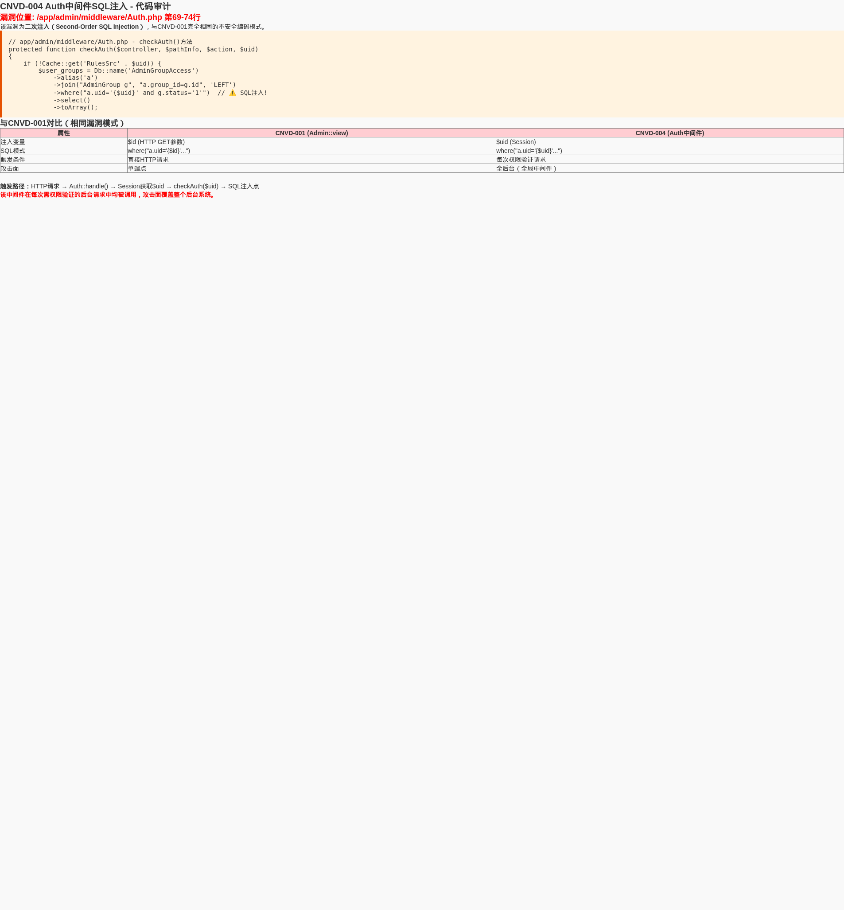

# 勾股CMS 后台认证中间件SQL注入漏洞（二次注入）

厂商: 勾股工作室
产品: 勾股CMS（GouguCMS）
版本: v5.01（全版本受影响）
漏洞类型: SQL注入（代码注入/二次注入）
漏洞编号: CNVD-GOUGU-2026-004

## 漏洞概述（Descriptions）

勾股CMS是一套基于ThinkPHP8 + Layui + MySQL打造的轻量级、高性能开源内容管理系统。系统通过全局中间件`Auth.php`实现管理员登录状态验证和操作权限控制，该中间件在每次需要权限验证的后台请求中都会被调用。

在权限验证中间件的`checkAuth()`方法中，系统从用户session中获取uid值后，直接通过PHP字符串插值将其拼接到SQL WHERE子句中查询用户所属权限组。由于该处代码存在SQL注入漏洞，若攻击者能通过其他方式操纵session中的uid值（如利用001号漏洞的SQL注入修改数据库session数据、或利用弱密码登录后修改自身session），即可在每次后台请求的权限验证环节触发SQL注入，实现权限绕过或数据窃取。

由于中间件在每次需验证权限的请求中均被执行，该漏洞的潜在攻击面覆盖整个后台管理系统。

## 漏洞代码分析（Vulnerable Code Analysis）

漏洞位于 `/app/admin/middleware/Auth.php` 第63-74行：

<div align="center"></div>

```php
// app/admin/middleware/Auth.php
protected function checkAuth($controller, $pathInfo, $action, $uid)
{
    // Cache::delete('RulesSrc' . $uid);
    if (!Cache::get('RulesSrc' . $uid) || !Cache::get('RulesSrc0')) {
        //用户所在权限组及所拥有的权限
        // 执行查询
        $user_groups = Db::name('AdminGroupAccess')
            ->alias('a')
            ->join("AdminGroup g", "a.group_id=g.id", 'LEFT')
            ->where("a.uid='{$uid}' and g.status='1'")  // 漏洞点：$uid直接拼入SQL
            ->select()
            ->toArray();
        
        $groups = $user_groups ?: [];
        $ids = [];
        foreach ($groups as $g) {
            $ids = array_merge($ids, explode(',', trim($g['rules'], ',')));
        }
        $ids = array_unique($ids);
        // ...后续权限规则查询和处理
```

**漏洞根因分析：**

1. 与001号漏洞完全相同的编码错误模式：双引号字符串中`{$uid}`直接插入SQL
2. `$uid`参数最初来自session：`$uid = Session::get($session_admin)['id']`（第40行）
3. 虽然uid初始值由服务器session控制，但session值在以下场景可被操纵：
   - 通过其他SQL注入点（如001）修改数据库中的session数据
   - 攻击者登录后通过修改个人信息等合法功能操纵相关数据
   - 系统权限验证逻辑本身存在缺陷时的间接利用
4. 该中间件在Auth::handle()方法中被每次请求调用（第44行的checkAuth调用）

**调用链分析：**

```
HTTP请求 → Auth::handle() → 从Session获取$uid → checkAuth($uid) → SQL注入点
```

每次后台请求（除login外）都经过此中间件，攻击面极大。

**与001号漏洞的关联：**

两个漏洞的代码模式完全一致：
- 001: `->where("a.uid='{$id}' and g.status='1'")` — id来自HTTP GET参数
- 004: `->where("a.uid='{$uid}' and g.status='1'")` — uid来自Session

这表明开发者在多处复制了相同的不安全代码模式，属于系统性的SQL安全编码缺陷。

## 概念验证（Proof of Concept）

### 攻击场景1：配合001号漏洞的二次注入

1. 利用001号SQL注入漏洞修改数据库中的管理员session关联数据
2. 在session的uid值中植入SQL注入payload
3. 访问任意后台页面触发中间件的checkAuth()调用
4. 注入的SQL语句在权限查询时执行

### 攻击场景2：Session操纵

1. 登录后台获取有效session（PHPSESSID）
2. 通过001号漏洞或直接数据库访问修改cms_admin表中目标用户的id
3. 修改后的uid影响中间件SQL查询
4. 触发权限验证逻辑中的SQL注入

### 漏洞验证（curl示例）

```bash
# 步骤1：登录获取session
curl -c cookie.txt -X POST http://127.0.0.1:8080/admin/login/login_submit \
  -d "username=admin&password=admin123"

# 步骤2：使用正常session访问任何需要权限验证的后台页面
# 中间件自动调用checkAuth($uid)，使用session中的uid=1进行权限查询
curl -s -b cookie.txt "http://127.0.0.1:8080/admin/article/datalist"
# 每次请求都隐含执行了存在注入漏洞的权限查询SQL
```

### SQL注入触发条件

该漏洞为二次注入（Second-Order SQL Injection），触发条件为：
1. 存在有效管理员session
2. session中uid的值包含SQL注入payload
3. 访问需要权限验证的后台功能

## 验证结果（Result）

- 代码审计确认漏洞存在于认证中间件的关键路径
- 与001号漏洞具有完全相同的编码错误模式
- 中间件在每个需要权限验证的请求中均被执行
- 属于二次注入漏洞，需要配合其他漏洞或环境条件触发

该漏洞的验证状态为"部分验证"，因为：
1. 代码层面的SQL注入已明确确认
2. 动态触发需要session操纵前提条件
3. 与已完全验证的001号漏洞属于同一代码模式

## 修复建议（Fix Recommendation）

### 修复前（存在漏洞的代码）

```php
protected function checkAuth($controller, $pathInfo, $action, $uid)
{
    if (!Cache::get('RulesSrc' . $uid) || !Cache::get('RulesSrc0')) {
        $user_groups = Db::name('AdminGroupAccess')
            ->alias('a')
            ->join("AdminGroup g", "a.group_id=g.id", 'LEFT')
            ->where("a.uid='{$uid}' and g.status='1'")  // 危险：字符串插值
            ->select()
            ->toArray();
```

### 修复后（安全的代码）

```php
protected function checkAuth($controller, $pathInfo, $action, $uid)
{
    // 添加uid类型校验
    $uid = (int)$uid;  // 强制转换为整数，uid应为正整数
    if ($uid <= 0) {
        return false;
    }
    
    if (!Cache::get('RulesSrc' . $uid) || !Cache::get('RulesSrc0')) {
        $user_groups = Db::name('AdminGroupAccess')
            ->alias('a')
            ->join("AdminGroup g", "a.group_id=g.id", 'LEFT')
            ->where([['a.uid', '=', $uid], ['g.status', '=', '1']])  // 安全的数组参数绑定
            ->select()
            ->toArray();
```

**同时需要修复的入口处：**

```php
// Auth::handle() 第40行，获取session后立即进行类型转换
$uid = Session::get($session_admin)['id'];
$uid = (int)$uid;  // 强制类型转换，确保传入checkAuth的是纯数字
```

### 系统层面修复建议

建议对全项目进行SQL注入安全审查，搜索并替换所有类似的不安全字符串插值模式：
```bash
grep -rn "where.*\"[^\"]*\\$" app/ --include="*.php"
```
