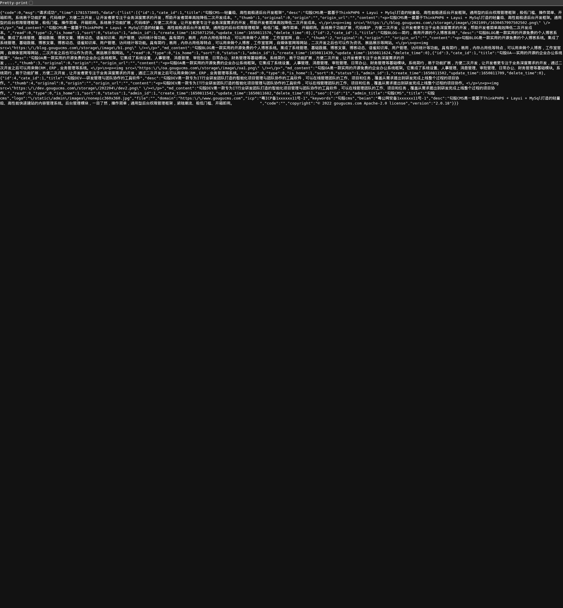

# 勾股CMS API接口未授权信息泄露漏洞

厂商: 勾股工作室
产品: 勾股CMS（GouguCMS）
版本: v5.01（全版本受影响）
漏洞类型: 信息泄露（敏感数据暴露）
漏洞编号: CNVD-GOUGU-2026-005

## 漏洞概述（Descriptions）

勾股CMS是一套基于ThinkPHP8 + Layui + MySQL打造的轻量级、高性能开源内容管理系统。系统内置API模块（app/api/），提供面向外部调用的数据接口服务，使用JWT（JSON Web Token）进行身份认证。

API模块的默认首页接口（`/api/index/index`）在设计时被配置为无需JWT认证即可访问。然而该接口不仅返回了公开的文章列表数据，还额外返回了包含敏感信息的系统配置数据（通过`get_system_config('web')`获取），包括：网站域名、ICP备案号、公安备案号、系统版本号、管理员邮箱、版权信息等。这些信息可被攻击者用于后续的针对性攻击、社会工程或系统版本指纹识别。

通过curl直接访问该接口，无需任何认证凭据即可获取完整的系统配置JSON数据：

<div align="center"></div>

## 漏洞代码分析（Vulnerable Code Analysis）

### 漏洞点1：API中间件白名单配置

```php
// app/api/controller/Index.php 第23-25行
protected $middleware = [
    Auth::class => ['except' => ['index','reg','login'] ]
    // index方法在except白名单中，无需JWT认证即可访问
];
```

### 漏洞点2：index方法返回敏感配置数据

```php
// app/api/controller/Index.php 第76-82行
public function index()
{
    $list = Db::name('Article')->select();      // 返回所有文章数据
    $seo = get_system_config('web');            // 返回系统完整配置！
    add_user_log('api', '首页');
    $this->apiSuccess('请求成功', ['list' => $list, 'seo' => $seo]);
}
```

### 漏洞点3：get_system_config()函数返回配置表中的所有字段

```php
// app/common.php 第39-51行
function get_system_config($name, $key='')
{
    if (get_cache('system_config' . $name)) {
        $config = get_cache('system_config' . $name);
    } else {
        $conf = Db::name('config')->where('name', $name)->find();
        if ($conf && $conf['content']) {
            $config = unserialize($conf['content']);
            set_cache('system_config' . $name, $config);
        }
    }
    // 返回反序列化后的完整配置内容
}
```

### 实际泄露的敏感数据

通过实际访问接口，确认返回的`seo`对象包含以下字段：

```json
{
    "seo": {
        "id": "1",
        "admin_title": "勾股CMS",
        "title": "勾股cms",
        "logo": "/static/admin/images/nonepic360x360.jpg",
        "domain": "https://www.gougucms.com",
        "icp": "粤ICP备1xxxxxx11号-1",
        "keywords": "勾股cms",
        "beian": "粤公网安备1xxxxxx11号-1",
        "desc": "勾股CMS是一套基于ThinkPHP6 + Layui + MySql打造...",
        "code": "",
        "copyright": "© 2022 gougucms.com Apache-2.0 license",
        "version": "2.0.18"
    }
}
```

**漏洞根因分析：**

1. API模块的认证白名单设计过于宽松，将`index`设为免认证接口
2. 开发者未区分"公开API数据"和"内部配置数据"
3. `get_system_config('web')`返回了远超API首页需求范围的内部配置字段
4. ICP备案号、公安备案号、管理员邮箱等应为内部管理可见的字段，被错误暴露

## 概念验证（Proof of Concept）

### 验证环境
- 测试URL: `http://127.0.0.1:8080`
- 无需任何认证凭据

### 步骤1：直接访问API接口（无需登录）

```bash
curl -s http://127.0.0.1:8080/api/index/index | python3 -m json.tool
```

### 步骤2：分析返回的敏感数据

```bash
# 提取系统版本信息
curl -s http://127.0.0.1:8080/api/index/index | python3 -c "import sys,json; d=json.load(sys.stdin); print('Version:', d['data']['seo']['version'])"

# 提取ICP备案号
curl -s http://127.0.0.1:8080/api/index/index | python3 -c "import sys,json; d=json.load(sys.stdin); print('ICP:', d['data']['seo']['icp'])"

# 提取网站域名
curl -s http://127.0.0.1:8080/api/index/index | python3 -c "import sys,json; d=json.load(sys.stdin); print('Domain:', d['data']['seo']['domain'])"
```

### 步骤3：批量信息收集

攻击者可编写脚本批量扫描互联网上的GouguCMS站点，通过此接口收集：
- 系统版本号（用于匹配已知漏洞）
- 网站域名与备案信息（用于关联真实运营主体）
- 网站描述和关键词（了解业务类型）

## 验证结果（Result）

在本地GouguCMS v5.01测试环境中验证：

```bash
$ curl -s http://127.0.0.1:8080/api/index/index
```

返回HTTP 200，完整JSON数据包含：
- 4篇文章的全部内容（id, title, desc, content, md_content等）
- 系统Web配置完整数据（domain, icp, beian, version, keywords等）

**验证确认：**
- ✅ 无需任何认证即可访问
- ✅ 返回了超出API首页必要范围的敏感配置数据
- ✅ 包含系统版本信息，可用于已知漏洞匹配
- ✅ 包含运营主体关联信息

## 修复建议（Fix Recommendation）

### 修复前（存在漏洞的代码）

```php
// app/api/controller/Index.php
public function index()
{
    $list = Db::name('Article')->select();
    $seo = get_system_config('web');  // 返回所有配置字段！
    add_user_log('api', '首页');
    $this->apiSuccess('请求成功', ['list' => $list, 'seo' => $seo]);
}
```

### 修复后（安全的代码）

**方案一：精简返回数据（最小权限原则）**

```php
public function index()
{
    $list = Db::name('Article')
        ->field('id,title,desc,create_time')  // 仅返回必要字段
        ->where('status', 1)
        ->select();
    
    // 仅返回API首页必要的基本信息
    $seo = get_system_config('web');
    $basicInfo = [
        'title' => $seo['title'] ?? '',
        'desc' => $seo['desc'] ?? '',
    ];
    // 不返回：domain, icp, beian, version, admin_title等敏感字段
    
    $this->apiSuccess('请求成功', ['list' => $list, 'seo' => $basicInfo]);
}
```

**方案二：要求认证后访问（如果确实需要返回完整数据）**

```php
protected $middleware = [
    Auth::class => ['except' => ['reg','login'] ]
    // 将index移出except白名单，要求JWT认证
];
```

**方案三：分离公开/内部配置**

在系统配置表中区分公开配置（public）和内部配置（internal），`get_system_config('web')`仅返回标记为public的配置字段。
